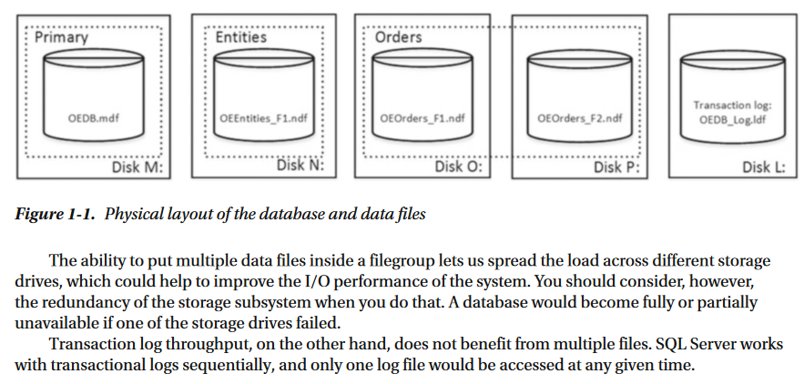

# Data Storage Internals
- A SQL Server database is a collection of objects that allow you to store and manipulate data.
- In theory, SQLServer supports 32,767 databases per instance
- the number of databases SQL Server can handle depends on the load and hardware

## Database Files and Filegroups
- Every database consists of one or more transaction log files and one or more data files.
- **A transaction log:** stores information about database transactions and all of the data modifications made in each session
- Every database has one primary data file, which by default has an .mdf extension
- In addition, every database can also have secondary database files. Those files, by default, have *.ndf* extensions.
- All database files are grouped into filegroups.
    *   *A filegroup* is a logical unit that simplifies database administration.
diffrence among.(MDF, NDF, LDF, Temp DB files and Filegroups)[https://seanmcateer.wordpress.com/2015/10/20/mdf-ndf-ldf-temp-db-files-and-filegroups/]



>
You can specify initial file sizes and auto-growth parameters at the time that you create the database
or add new files to an existing database. SQL Server uses a proportional fill algorithm 
>

#### proportional fill algorithm
Storage Engine. It uses a fill mechanism that writes data to the database files depending on the amount of free space in each data file rather than writing in each file untill it is full then moving to the second one sequentially This data filling algorithm is called *Proportional Fill Algorithm*

- Eample:
 * if the first data file has 10 MB free space and the second one has 20 MB
 * the storage engine will fill one extent(is 8 pages with size 64kb) to the first file and two extents to the second one
 * If auto-growth is enabled to the database files and the database files become full, the SQL Server Database Engine will expand the database files one at a time and write to that file
more about (proportional fill algorithm)[https://www.sqlshack.com/understanding-sql-server-proportional-fill-algorithm/]

HINT: 
>
Setting the same initial size and auto-growth parameters for all files in the filegroup is usually enough to keep the proportional fill algorithm working efficiently. 
>

#### Sql server 2016 file GROWTH
SQL Server 2016 introduces two options—*AUTOGROW_SINGLE_FILE* and AUTOGROW_ALL_FILES— which
control auto-growth events on a per-filegroup level. With *AUTOGROW_SINGLE_FILE* , which is the default
option, SQL Server 2016 grows the single file in the filegroup when needed. With *AUTOGROW_ALL_FILES* , SQL
Server grows all files in the filegroup whenever one of the files is out of space.
- When using SQL Server releases prior to 2016, you can control this behavior with the instance-level trace flag T1117

## Data Pages and Data Rows
- The space in the database is divided into logical 8KB pages.
- These pages are continuously numbered starting with zero, and they can be referenced by specifying a file ID and page number

#### DATA STORAGE IN SQL SERVER
- row-based storage
- columnstore indexes and column-based storage (SQL Server 2012)
- set of in-memory (SQL Server 2014)

*Data Page Structure*:


- A 96-byte page header contains various pieces of information about a page, such as the object to which
the page belongs, the number of rows and amount of free space available on the page, links to the previous
and next pages if the page is in an index-page chain
- Data Row: Is the area where actual data is stored. 
- slot array(Offset Array):  which is a block of two-byte entries indicating the offset at which the corresponding data rows begin on the page

``` sql
sys.dm_db_database_page_allocation
``` 

## Large Objects Storage

## SELECT * and I/O
There are plenty of reasons why selecting all columns from a table with the SELECT * operator is not a good idea.
-  It increases network traffic by transmitting columns that the client application does not need.
-  makes query performance tuning more complicated
-  it introduces side effects when the table schema changes

This is especially important with row-overflow and LOB storage, when one row can have data stored in multiple data pages. SQL Server needs to read all of those pages, which can significantly decrease the performance of queries

## Extents and Allocation Map Pages
SQL Server logically groups eight pages into 64 KB units called extents

Types of Extents:
- *mixed extents* store data that belongs to different objects
- *uniform extents* store the data for the same object

By default, when a new object is created, SQL Server stores the first eight object pages in mixed extents.

SQL Server uses a special kind of pages, called **allocation maps**, to track extent and page usage in a file

Types of Allocation Maps:
- Global allocation map (GAM) pages 
    * track if extents have been allocated by any objects
    * The data is represented as bitmaps, where each bit indicates the allocation status of an extent. Zero bits indicate that the corresponding extents are in use. The bits with a value of one indicate that the corresponding extents are free
    * Every GAM page covers about *64,000 extents*, or almost 4 GB of data. This means that every database file has one GAM page for about 4 GB of file size

- Shared global allocation map (SGAM) pages
    * track information about mixed extents. Similar to GAM pages


